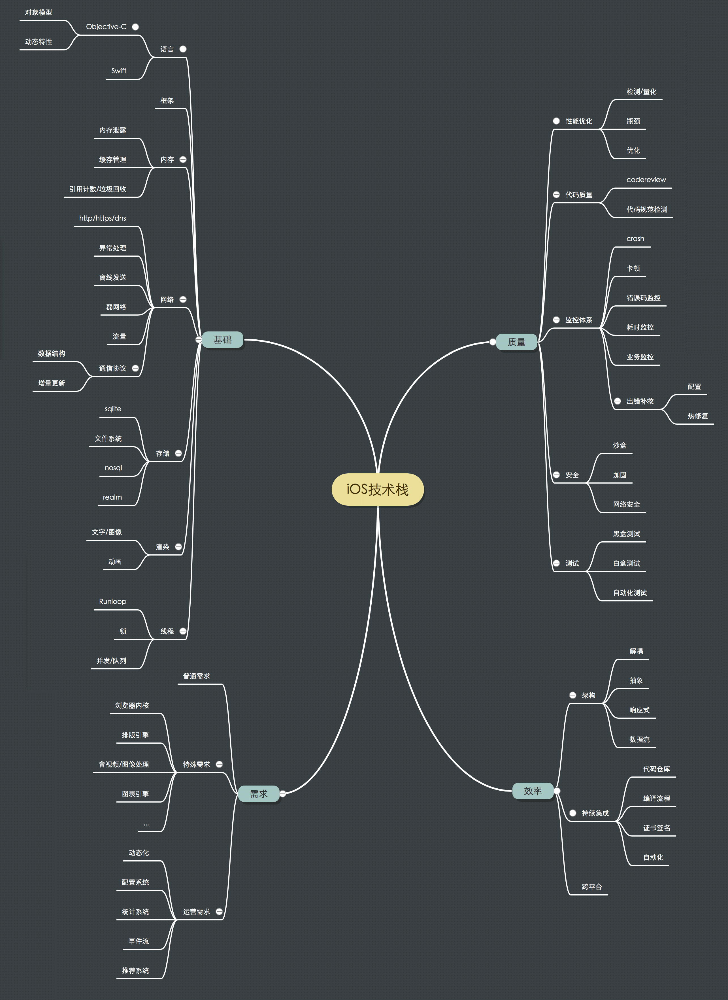

[Apple 开发者文档](<https://developer.apple.com/library/archive/navigation/>) (是个好东西，可以经常读读)





### 经历

我在二维火的工作主要分为四个部分：

第一个部分是日常业务相关的，我主要参与了采购平台、收银设置以及外卖模块的开发，后续也一直负责收银设置以及外卖模块的维护工作。

第二个部分是基础功能相关的，我主要创建并维护了一系列基础组件，比如选择器组件、图片浏览器组件、地图组件、表单组件、业务网络层组件等。

第三个部分是效率相关的，我主要推进了组件化的进程，主导剥离核心底层组件，并且开发登录助手供壳工程单独开发调试，在业务组件拆分比较完善之后，独立负责了组件 CI 平台接入，以及组件二进制化，组件自动化发布平台的建设，比较明显地优化了日常项目的开发效率。

第四个部分是动态化相关的，我主要负责了动态化 JSON 模版制定及其解析器编写，版本管理流程制定及代码编写，动态化后台管理前端页面编写

### 项目

##### 网络层重构

旧网络层存在的问题：

- 依旧使用集约型方式对 AFNetworking 进行了一层简单的封装，没有给使用者明确的约束，容易出现风格不同的接口方法
- 请求不方便随页面释放自动取消，在强交互的情况下，非常影响体验
- 难以进行灵活定制，固化一部分常用代码逻辑

改造方式：

- 采用分布式 API 对每个请求进行统一封装，业务请求通过继承抽象 API 获得发起请求及处理响应的基本功能，业务房可以在子类中处理部分请求构造和响应解析流程。这里为了规避类爆炸，也创建了通用 API 供业务方使用。将 API 抽象成对象后，可以将其和控制器生命周期绑定，实现请求的自动取消。
- 提供 block + notification 回调形式给业务方，block 用于非跨层调用，notification 用于跨层调用。使用 block 而不是 delegate 是因为回调代码和输入逻辑可以放在一块，并且在页面网络调用比较复杂的情况下，block 能够减少业务方主动创建的中间变量，更利于后期阅读
- 利用分布型 API 对切片机制友好的特点，可以创建很多扩展
  - 网络请求 HUD ，业务方存在多种 HUD 样式，展示逻辑为发起前展示 HUD，回调成功去除 HUD，回调失败去除 HUD 并展示失败样式，这个部分可以说是**业务无关**代码，在一个页面有多种请求时，每次都写很不干净。通过 API 的切片机制，可以很方便地获知上面三个时间点，并定制 HUD 管理者，使用者只需要在配置 API 时传入不用样式的 HUD 管理者即可。大部分情况下，请求失败时，我们只做 HUD 相关的操作，有了 HUD 管理者，就可以不用专门为这部分操作实现回调。
  - 分页请求 API，分页其实是通用逻辑，这部分以前散落在请求的 VC 中，并且业务方通常会重复编写这部分代码。引入分布型概念后，可以利用 API 的独立性，将这部分逻辑单独放在分页 API 中，业务方只关注数据的获取，如果要获取下一页，直接使用 startForNextPage 方法即可。
  - 有分页请求的情况下，上下拉加载一般是标配。老的集中式 API，业务方一般在 VC 里手动管理刷新状态，然后添加新增数据等操作。在使用分页 API 后，由于有统一的回调出口，并且 API 有当前请求的所有信息，可以很方便地作为分页加载器的数据抓取者，实际使用时，业务方只需要调用分页加载器的 load 方法，并且结合我们的表单框架返回对应的 item 即可。通过这种方式，可以完全剥离 VC 中分页逻辑。
  - 批量请求 API ，有些网络场景需要若干个网络请求都结束后才通知业务方，但是在其中某个特定请求完成后也需要执行一个业务回调。由于每个 API 上携带了回调信息，请求完成时会自动回调，所以这里只需要使用 dispatch_group 去监听所有请求，在请求都结束的时候调用批量请求 API 的公用回调。这种方式让整体设计保持一个离散和集中都能得到很好处理的情况，保证上层业务的可扩展性。

效果：

- 统一了网络层接口与调用方式，代码更易读
- 增加了网络层的灵活性和扩展性
- 目前的几个扩展可以比较明显地减少 VC 中的代码量，在只有分页逻辑的 VC 中，甚至可以减少 50% 以上的代码。

##### 组件二进制化插件及多组件发布平台

背景：

- 组件化逐渐成熟，组件越来越多，编译时间变长，组件发版互相依赖，组件维护问题凸显

解决方式：

- 针对编译和打包时常这块，结合版本管理工具 cocoapods ，开发了 cocoapods-bin 插件，插件可辅助切换单个 / 全部组件的依赖方式，自动生成二进制 podspec，并且引入了多线程下载，显著减少了编译打包时间。在二进制化工具链的基础上，接入 CI 平台，制定 pipeline 流程，自动化处理代码校验，打包，发布，减少开发人员工作量
- 针对组件发版相互依赖这块，开发效能平台，利用 GitLab 开放 API 和 pipeline 的 webhook ，自动分析发版组件间的依赖，并通过接口触发组件的 pipeline，在借助 pipeline 保证代码 lint 成功的情况下，执行合并与发布，开发人员只需要在网页上执行一次发布操作，即可发布版本依赖的所有组件并且自动同步信息到目标分支的 Podfile，极大的减少了多组件发版工作量。并且效能平台还通过 cocoapods 私有源的 webhook ，收集所有组件的 CI 信息，集合在前端页面展示，让多个业务线可方便地查看每日定时 pipeline 结果，以确保组件代码的正确性。后期还在效能平台上增加了启动监测和泄漏监测，监测内测阶段 App 启动到 didLaunch、willLaunch 到 didLaunch 、+load 方法执行这些启动项。

##### 掌柜客户端动态化跨平台服务

背景：

- 掌柜客户端面向 To B 用户，很多列表页、设置页的样式变化并不大，更多的是在已有样式池的基础上，通过搭积木的方式去堆出一个页面，所以为了减少两端编写页面的工作量，我们想要有一套跨平台的技术，通过一份代码文件配置两端页面，更进一步的，能够像 workflow 那样，通过在网页上拖拽样式池中的积木，来组成一个页面
- 掌柜客户端业务需求更新频繁，我们希望能有一种动态下发技术，往大了说能下发页面，往小了说能修复页面 bug

初步想法：

- 通过 JSON **模版** + 自建解释器来实现这个服务
  - JSON 用来描述页面的属性，自建解释器来执行页面中组件的交互动作
- 为什么要自建解释器，而不是 JSCore
  - 我们希望能约束开发者，将更多的属性固化在 JSON 配置中，下次要用直接拖过来即可，而不是通过动态的代码来实现相应功能，这样更有利于通过拖拽预置的配置来组成一个页面
  - 实际上我当时在另一个业务线也参与了类似的跨平台技术，他们采用 JSON 描述页面属性，采用在 JSExport 中向 JS 暴露特定方法来操作组件间的交互动作，但也导致了实现边界模糊，哪些要固化在原生组件中，哪些要在 JS 中实现，既然 JS 可以实现这个功能，为什么还要固化在组件中，是选择灵活性，还是精简性，这种争论也伴随了这套技术的后续应用流程，因为不同开发者的想法并不一致。

- 如何使用 JSON 描述页面属性
  - 在我上个参与的跨平台方案中，我们会针对每一个特定的样式创建一个对应的类，然后使用 JSON 直接去逐个描述这个类的各个属性，这导致了后期各个样式对应的 JSON 结构差别越来越大，不利于维护和编写，更别谈自动拖拽组成页面了。在新的跨平台方案中，我们使用独立的 JSON 结构描述这个类的各个属性，然后使用这个结构组成的数组来描述特定样式，这样每个属性也成了可配置单元。

```
A 会员在用的  B 正在开发的

A B 同样使用 JSON 作为模版载体
A 用 JS 作为组件交互及数据流动操作载体，通过 JSExport 定义接口，更灵活，灵活同样会导致开发人员容易轻模版，重行为（JS），关于两者之间的权衡比较耗费时间和精力，目前我并不觉得你们是处理地比较好的，后期不好约束，难以成体系。
B 用实现轻量解释器 ，使用简单表达式作为组件交互及数据流动操作载体，更规范，将一部分动作也通过JSON定义（Action），可以覆盖 A JS 的部分功能，可以更多地将功能点及界面元素固化在原生代码中，通过 JSON 配置，是另一种意义上的灵活，这种灵活更容易掌控，组合。

A 由于 JS 灵活，揽下了一些应该固化到原生的活，导致难以使用 IDE 去管理和创建，如果有 IDE， 至多只能生成界面相关的 JSON
B 更像积木，大部分活，甚至是 A 的 JS 中的活都固化到原生了，所以用 IDE 去创建管理也就比较方便了

A 暂时不需要用 IDE 管理，也是一种好处
B 由于要把东西打的更细，导致 JSON 表述起来比较繁杂，不用 IDE 的话，没有 A 来的直观，必须要有一套完善的机制来承载，其中就包括 IDE 及 后台

A 开发用用 
B 由于有 IDE ，可以给产品用用 + 开发用用

A 没有一套管理机制，维护靠人工
B 还是 IDE 与一整套策略，后期维护 JSON 方便
```


整体架构：


- 最底层由更新策略、状态缓存、解释器、数据绑定提供基础服务
- 上一层是雪拉比，提供 JSON 页面解析功能
- 再上一层是Component库、Action库、Validation库、Error库，这些库对应的 JSON 结构拼装成页面 JSON  ( 具体对应 componets 、actions、validations、onError 等字段)，用来描述一个页面的展示属性与交互动作，由雪拉比负责解析
- 最顶层就是动态化页面了，即页面 JSON 数据

缓存架构：


- $data 用来存放页面中产生的临时数据，比如网页请求 Action 执行后，可以把请求结果通过 StoreVar Action 保存在此对象中，生命周期和页面一致
- $global 用来保存全局对象，类似 App 里面的 DataCenter，全局可见，生命周期和 App 一致
- $param 用来保存上一个页面传递给当前页面的数据

页面架构：


- 元素类型
  - interactions ：交互动作集合 （由系统触发或者用户触发，对应原生某个方法）
  - actions: 行为集合（交互触发后，进行了一系列行为，对应原生某个类）
  - attributes：属性集合（对应原生某个属性）
  - components：组件集合（对应原生某个类）
  - loaded 等：生命周期交互 interaction

页面跳转：

- 原生 -> 动态化：指定动态化页面 id 实例化 DH 控制器，通过 params 属性传入参数
- 动态化 -> 动态化：指定动态化页面 id ，通过 Push Action 设置 params 推送控制器
- 动态化 -> 原生：指定原生页面对应路由 url ，通过 Push Action 推送控制器

页面交互：

- 传入
  - 通过 params 或者 url 的查询字段
- 传出
  - 动态化 -> 原生：原生实例化 DH 控制器时，设置 completion 回调，动态化页面在合适时机通过 Response Action 执行这个回调
  - 动态化 -> 动态化：通过 Push Action 跳转时，可以设置 waitForResult ，等待传递给下个页面的 completion 回调通过 Response Action  执行后，再将回调的数据传递给下个 Action
  - 原生 -> 动态化 ：Push Action 方面和 动态化 -> 动态化一致，只不过这个回调需要我们遵守 TDFCLViewControllerCommunicating 协议手动执行，而不是通过 Response Action

